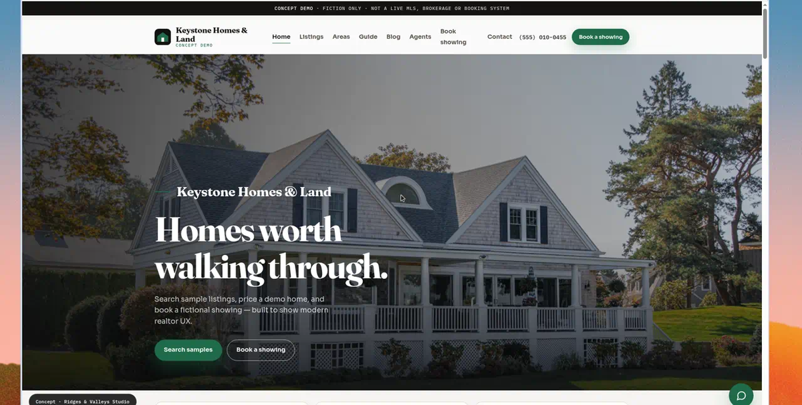
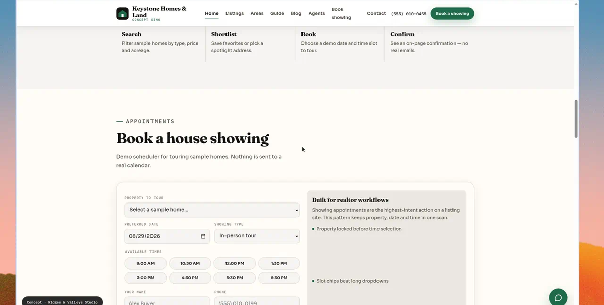
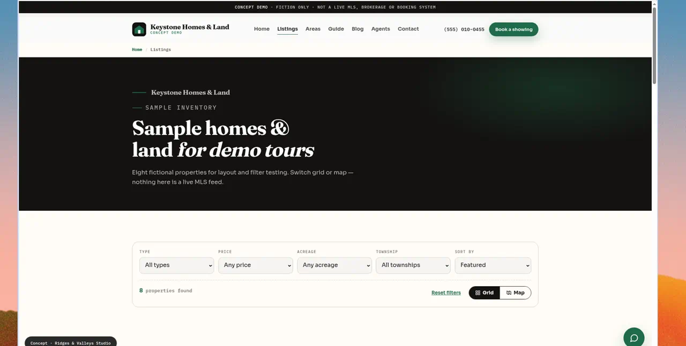
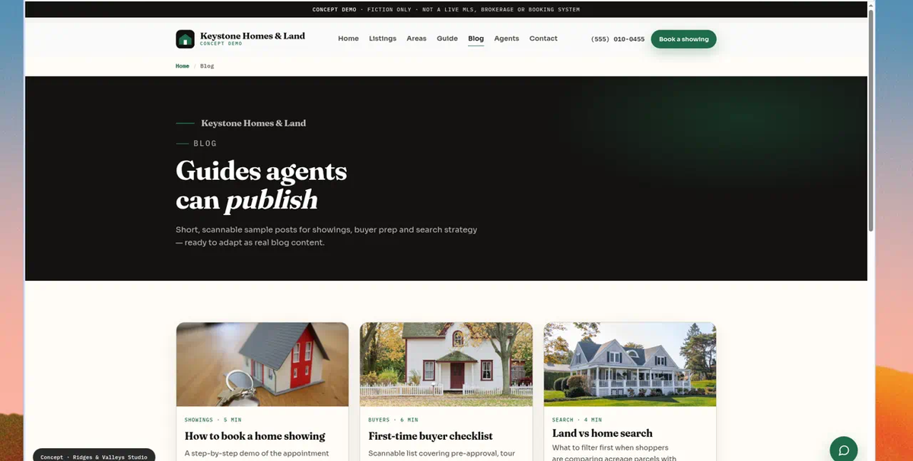
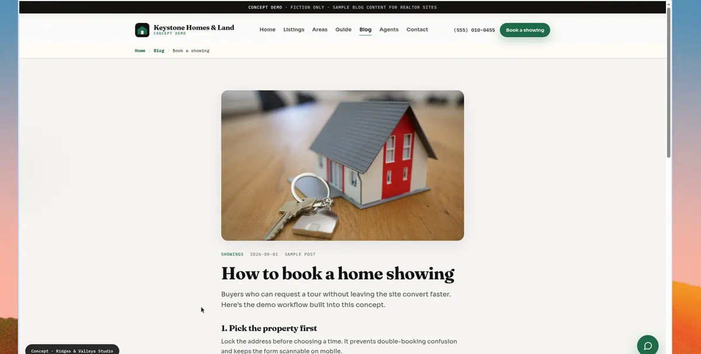

# Keystone Homes & Land

Self-initiated **land & farms realtor** concept by [Ridges & Valleys Studio](https://ridgesandvalleys.com) — grid/map listings, acreage filters, showing booking, and SEO-ready blog tools.

**[Live demo →](https://matthummel-pa.github.io/realtor-keystone-homes-and-land-theme/)**  
**Studio project page →** https://ridgesandvalleys.com/work/concept-realtor-keystone-homes-and-land/

> **Fiction only.** Listings, market stats, contact details, and appointments are sample data. Not a live MLS, licensed brokerage, or booking system.



## About

Keystone Homes & Land is a land-and-farms brokerage concept for Adams County buyers who need more than a city condo search. We focus on acreage, townships, and rural parcels — with map listings, clear filters, and tools to book a showing before you leave the page.

Built by [Ridges & Valleys Studio](https://ridgesandvalleys.com) in Gettysburg as a self-initiated, fully clickable demo — not a paid client project. The brand, listings, and numbers are illustrative so local agencies can see how a land-first realtor site could work.

---

## Concept page copy

Paste these into the WordPress **Projects** meta box on  
[`concept-realtor-keystone-homes-and-land`](https://ridgesandvalleys.com/work/concept-realtor-keystone-homes-and-land/)  
(fields map 1:1 to `_rv_*` keys).

### At a glance

| Field | Value |
| --- | --- |
| **Eyebrow** (`_rv_eyebrow`) | `Concept · Land & farms agency` |
| **Client / brand** (`_rv_client`) | `Keystone Homes & Land` |
| **One-line summary** (`_rv_summary`) | `A land-and-farms realtor concept with grid/map listings, acreage filters, house-showing booking, and an SEO blog.` |
| **Industry** (`_rv_industry`) | `Real estate · Land & rural` |
| **Location** (`_rv_location`) | `Gettysburg, PA` |
| **Services** (`_rv_services`) | `Web design, Map listings, Showing booking, SEO blog` |
| **Live site URL** (`_rv_url`) | `https://matthummel-pa.github.io/realtor-keystone-homes-and-land-theme/` |
| **Concept?** (`_rv_is_concept`) | checked (`1`) |

**Post excerpt** (same as summary — powers homepage cards):

```
A land-and-farms realtor concept with grid/map listings, acreage filters, house-showing booking, and an SEO blog.
```

### The story

**Challenge** (`_rv_challenge`)

```
Land and farm buyers need different filters — acreage, township, lot type — and a map. A generic home-search template can't show a 40-acre parcel the way it deserves, and high-intent visitors bounce when they can't book a showing on the agency's own site.
```

**Approach** (`_rv_approach`)

```
A grid-and-map listings experience built for rural property: acreage and area filters, payment estimates, a homepage house-showing scheduler, home-value and listing-alert demos, plus a realtor blog with sample posts agents can adapt for local SEO.
```

**Result** (`_rv_result`)

```
A concept that speaks land buyers' language, shows parcels on a map, educates with blog content, and moves serious buyers from browsing to a booked showing — without sending them to Zillow.
```

### Metrics (up to three)

| | Value (`_rv_m*_value`) | Label (`_rv_m*_label`) |
| --- | --- | --- |
| **1** | `Grid + map` | `listings` |
| **2** | `Book a` | `showing` |
| **3** | `SEO` | `blog ready` |

### Under the hood

**What was delivered** (`_rv_deliverables` — one per line)

```
Grid/map listings
Acreage + area filters
House-showing appointment booking
Home value + listing alert demos
Realtor blog + sample SEO posts
Mobile-first, accessible build
```

**Tech & tools** (`_rv_tech`)

```
WordPress, Sage, IDX-ready
```

*(Demo in this repo is static HTML/CSS/JS; WordPress/Sage/IDX is the handoff stack for a real agency site.)*

---

## Rank Math SEO (studio project page)

Use on the Ridges & Valleys **project** post (not the GitHub Pages demo).

| Field | Value |
| --- | --- |
| **Focus keyword** | `gettysburg real estate website` |
| **SEO title** | `Gettysburg Real Estate Website: Land & Farms Concept \| Ridges & Valleys` |
| **Meta description** | `Gettysburg real estate website concept for land and farms — grid/map listings, acreage filters, house-showing booking, and an SEO blog. Open the live demo.` |
| **Facebook / OG title** | `Gettysburg Real Estate Website: Land & Farms Concept \| Ridges & Valleys` |
| **Facebook / OG description** | `Land-and-farms realtor concept with map listings, acreage filters, showing booking, and a publish-ready blog. Built in Gettysburg for Adams County agencies.` |
| **Twitter title** | `Keystone Homes & Land — Gettysburg Realtor Concept` |
| **Twitter description** | `Grid/map listings, acreage filters, house-showing booking, and SEO blog tools — a land-and-farms realtor concept for Gettysburg & Adams County.` |

**Alt text** for the concept preview image:

```
Keystone Homes & Land — Gettysburg real estate website concept with map listings and showing booking
```

**Suggested internal links** from this project page: Local Launch / Growth Site services, Contact, and related work (Ridgeline Realty).

---

## Demo features (this repo)

### 1. Book a house showing
Highest-intent realtor action on the homepage: pick a sample property, date, and time slot.



### 2. Searchable sample listings
Filter by type, price, acreage, and area. Switch grid or map; open payment estimates.



### 3. Realtor blog ready to publish
Blog index plus sample posts for showings, buyer checklists, and land vs home search.





### 4. More homepage tools
| Tool | What it demos |
| --- | --- |
| **Buy / Sell / Tour** intent cards | Clear paths for different visitors |
| **Spotlight homes** | Scannable cards that prefill booking |
| **Home value estimate** | Instant fictional range (not an appraisal) |
| **Listing alerts** | Demo inbox signup for new matches |
| **Market pulse** | Sample stats for layout |
| **How-it-works** | Search → Shortlist → Book → Confirm |

### 5. Design, SEO & accessibility (demo site)
- Charcoal + stone + forest green system
- Fraunces display + Sora UI
- Meta / Open Graph / Twitter cards
- JSON-LD: `RealEstateAgent`, `WebSite`, `HowTo`, `FAQPage`, `Blog`, `BlogPosting`
- Skip link, focus-visible, `prefers-reduced-motion`, landmarks

## Site map

| Page | Path |
| --- | --- |
| Home | [`index.html`](index.html) |
| Listings | [`listings.html`](listings.html) |
| Areas | [`areas.html`](areas.html) |
| Buyer’s guide | [`guide.html`](guide.html) |
| Agents | [`agents.html`](agents.html) |
| Contact | [`contact.html`](contact.html) |
| Blog | [`blog.html`](blog.html) |
| Posts | [`posts/`](posts/) |

## Stack (demo)

Static site — no build step. `styles.css`, `main.js`, `home.js`, `listings.js`, `guide.js`. Fonts: Fraunces, Sora, IBM Plex Mono. Photos: Unsplash.

## Develop

```bash
python3 -m http.server 8765
# open http://127.0.0.1:8765/
```

## Deploy

Push to `main`. GitHub Pages publishes from the branch root (`/`).

**Live:** https://matthummel-pa.github.io/realtor-keystone-homes-and-land-theme/

## Source

Originally copied from  
`web/app/themes/ridgesandvalleys-theme/concept/realtor-keystone-homes-and-land/`  
in [matthummel-pa/ridgesandvalleys](https://github.com/matthummel-pa/ridgesandvalleys).

**This repo is the source of truth** for the live demo. Keep concept page copy in sync with the studio project post when features change.
